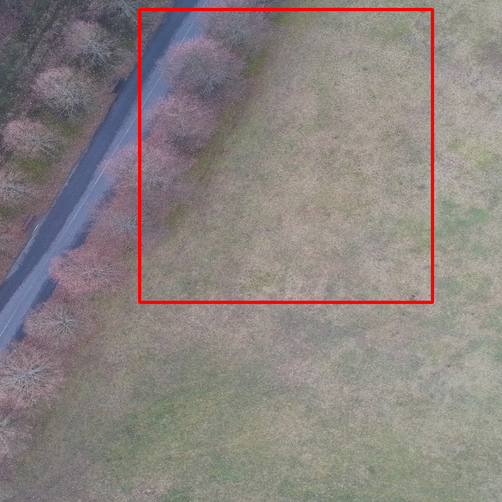
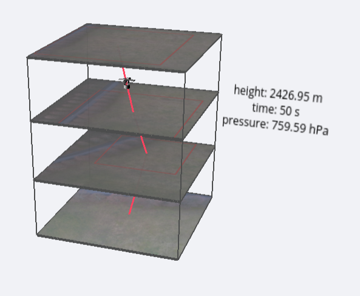

# CanSat Image finder
Image Finder for CanSat competition. Program is finding photos taken from lower height and finds them in photos taken from bigger height.

There are two version of the project: a and b. 
**Project-b** works better and has better efficiency.

## Folder structure description
### There are two version of project.
It wasn't known, which technology will work better, that's why our team decided to make two algorithms with different libraries. There were created two versions of project: 
- **project-a** (ResNet50, PyTorch, PIL, numpy)
- **project-b** (OpenCV, ResNet50, PyTorch, PIL, numpy)
 
 ### Each of project contains folders:

 - **data** - Here are stored photos used to test the efficiency of the algorithm
 - **results** - This folder contains the an image, on which there is  selected a shape, in which there was a found a second image.

The main program, in which all the action happens   is named **app.ipynb**. 

Finally, looking for the efficiency and end results, we decided to officially use the **project-b** algorithm.

## Example 
During the fall, probe will be taking photos of the ground. This is one of the pictures taken from drone 

This is example of image taken from the 60m height

This is example of image taken from the 35m height

And this is the final result:

The algorithm has found the image taken from lower height and selected its on the photo taken from bigger height. 

## Practice usage
Thanks the algorithm, we can analyze each of next images taken by probe and tell, where the probe has fallen and detect its flight trajectory. 

Our ground base contains a program, which runs the alogirithm for each of photos taken by probe. Thanks this, finally we will have a dataset of images. 
Those pictures will be presented  on the [webpage with 3D Map](https://github.com/Iwaniukooo11/cansat_data). It will also be shown a flight trajectory there. 

## Author
**Mateusz Iwaniuk** as a member of [Project Trailblazer](http://www.project-trailblazer.pl/) Team.

Special thanks to **deepsene ai** company for help and support.

 
	 

